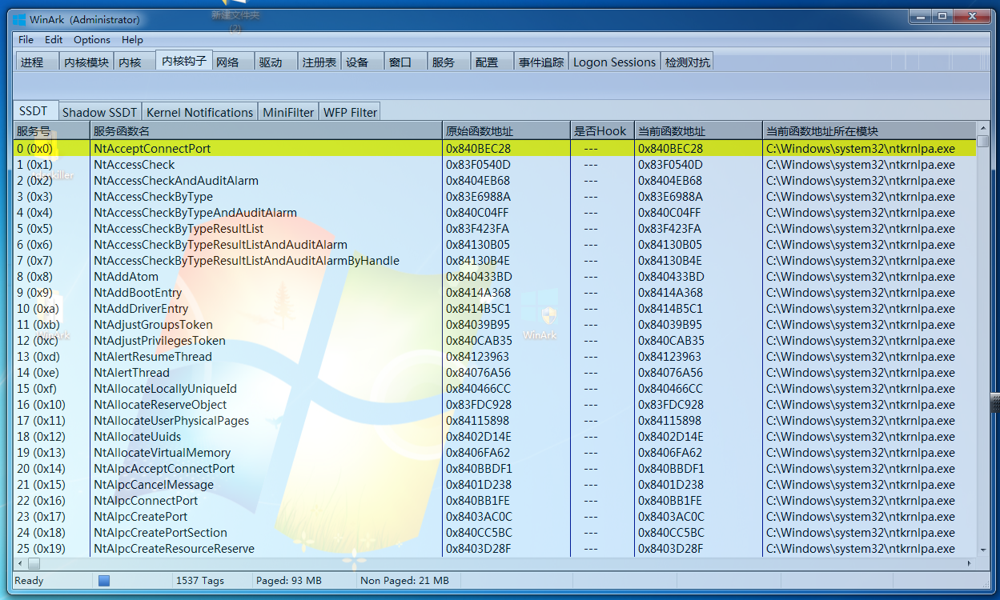
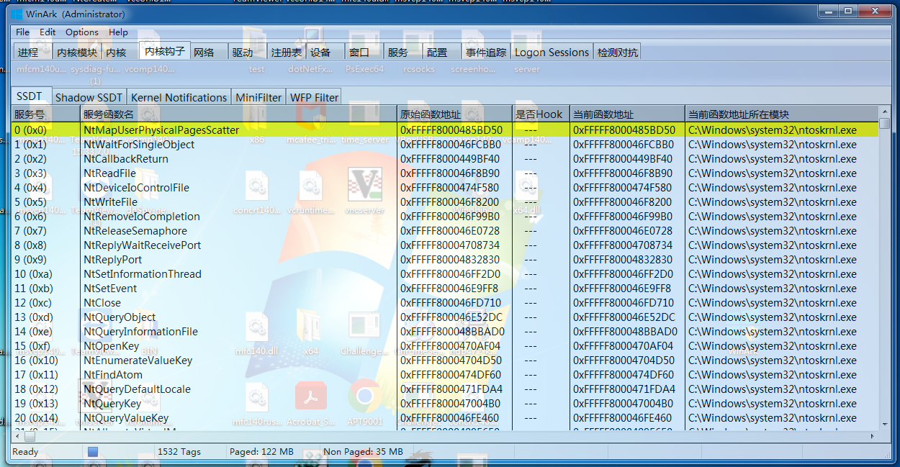
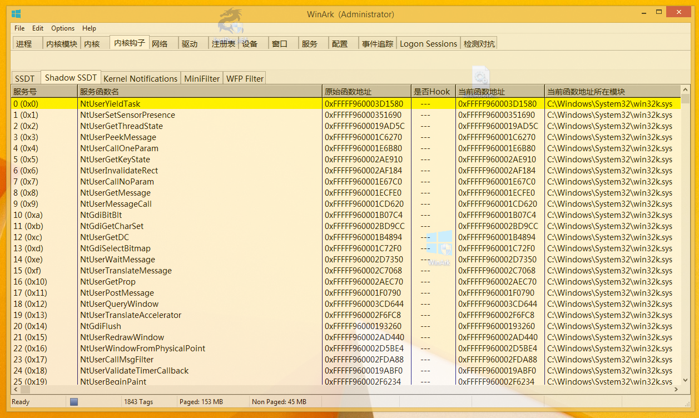
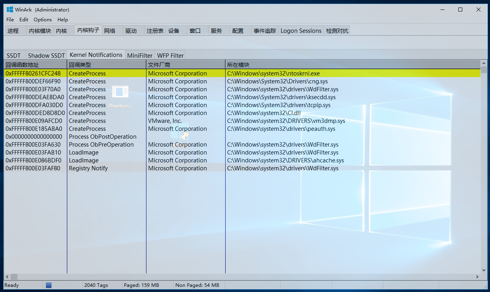
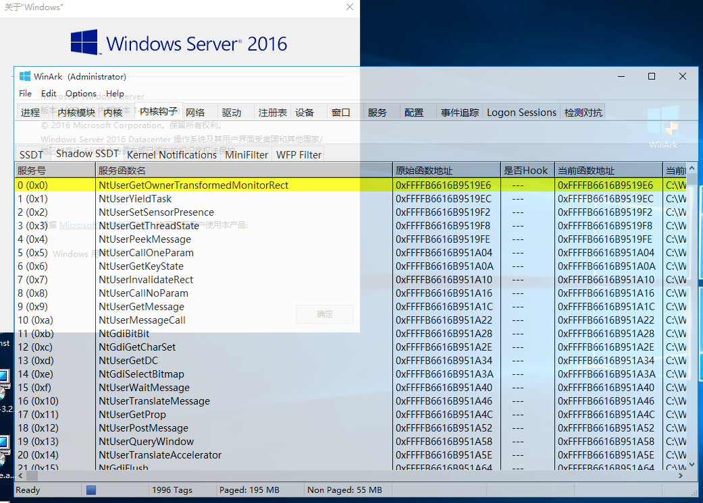
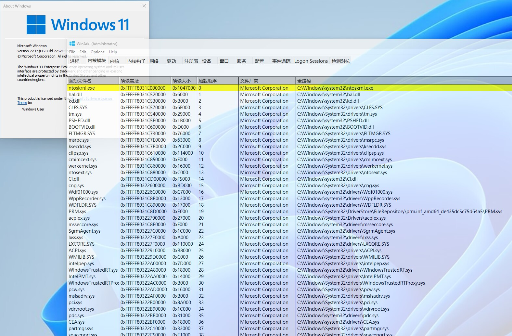

# How to build WinArk
## Prequisites

1. Install [Visual Studio 2019](https://learn.microsoft.com/en-us/visualstudio/releases/2019/release-notes). When you install Visual Studio 2019, select the Desktop development with C++ workload.
2. Download [WDK10](https://learn.microsoft.com/en-au/windows-hardware/drivers/download-the-wdk)
3. Install [vcpkg](https://github.com/microsoft/vcpkg)
4. Install [Windows Template Library](https://wtl.sourceforge.io/) and [Windows Implementation Libraries](https://github.com/microsoft/wil) by NuGet.
5. Install capstone for arch x86
```
vcpkg install capstone[x86]:x86-windows-static
vcpkg install capstone[x86]:x64-windows-static
vcpkg install poco[netssl]:x86-windows-static
vcpkg install poco[netssl]:x64-windows-static
```

## Compiling
1. First clone the repo then download the submodules
```
git clone https://github.com/BeneficialCode/WinArk
cd WinArk
git submodule update --recursive --init
```
1. Compile the Zydis kernel library

<1> Open the Zydis.sln in VS2019

<2> Batch Build `Zydis Debug/Release Kernel Win32 & x64`

<3> Batch Build `Zycore Debug/Release Kernel Win32 & x64`

Note: If you faced a error ———— 'A WDK corresponding to target '10.0.22000.0' xxxxx ...', Please change the sdk version.
After getting the Zydis librabry, you can do the next step.

2. Open the Anti-Rootkit.sln in Visual Studio 2019.
3. Compile the driver in Release mode first.
4. Compile the WinArk.

## Test environments

### Windows 7 x86


### Windows 7 x64


### Windows 8 x64


### Windows 10 x64


### Windows Server 2016 x64


### Windows 11 x64



